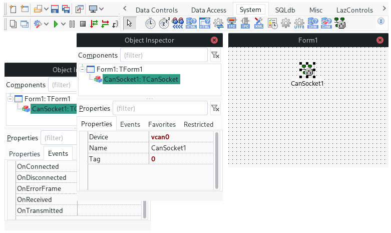
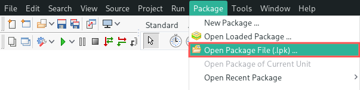
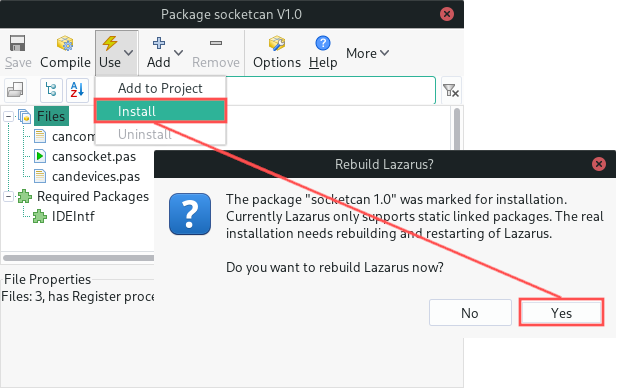
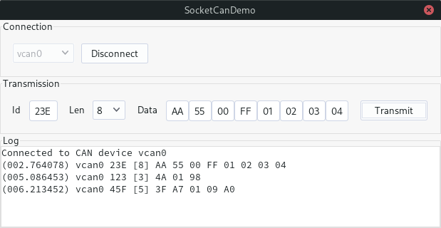

## Introduction

 `TCanSocket` is a Lazarus component for convenient and easy-to-use access to CAN communication. Perfect for when your Lazarus application should participate or monitor the communication on a Controller Area Network. Under the hood, it uses the SocketCAN functionality of the Linux kernel.

Supported functionality:

* List all SocketCAN devices known to your Linux system.
* Transmit and receive CAN messages.
* Event handlers for:
  * Reception of CAN messages and error frames.
  * Transmit completed of a CAN message.
  * Connect and disconnect events.

## Requirements

The following requirements need to be met, before you can use the `TCanSocket` component:

1. Lazarus is installed on your Linux system. The following article explains this step-by-step:
    * [How to install the Lazarus IDE on Linux](https://www.pragmaticlinux.com/2021/06/how-to-install-the-lazarus-ide-on-linux/)
2. The [LibCanComm](https://github.com/pragmaticlinuxblog/cancomm) shared library (including its development package) is installed on your Linux system:
    * [Install the LibCanComm shared library on Linux](https://github.com/pragmaticlinuxblog/cancomm/releases)
3. You already configured and brought your CAN adapter online. If not, follow one of these tutorials:
    * [How to create a virtual CAN interface on Linux](https://www.pragmaticlinux.com/2021/10/how-to-create-a-virtual-can-interface-on-linux/)
    * [Automatically bring up a SocketCAN interface on boot](https://www.pragmaticlinux.com/2021/07/automatically-bring-up-a-socketcan-interface-on-boot/)
    * [CAN communication on the Raspberry PI with SocketCAN](https://www.pragmaticlinux.com/2021/10/can-communication-on-the-raspberry-pi-with-socketcan/)

## Installation

To install the `TCanSocket` component, download the latest stable release from the GitHub project:

* [Download the latest stable release of `TCanSocket`](https://github.com/pragmaticlinuxblog/cancomm_lazarus/releases)

Next, extract the downloaded archive and open the `socketcan.lpk` package file from the `source/` subdirectory:

Once opened, select *Install* from the *Use* menu and click *Yes* when prompted to rebuild the Lazarus IDE:

After Lazarus completes rebuilding itself, it automatically restarts. Afterwards, you can find the `TCanSocket` component on the *System* tab of the *Component Palette*.

## Demo application

To test that everything works, the archive you downloaded includes a demo application. You can find it in the `demo/` subdirectory. Its project file is called `SocketCanDemo.lpi`. The application demonstrates how to connect to a SocketCAN device and how to transmit and receive CAN messages. It logs all transmitted and received CAN messages to a `TMemo`:

## License

