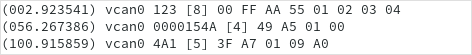

 A Lazarus component for convenient and easy-to-use access to CAN communication, using the SocketCAN functionality of the Linux kernel.

```pascal
type TCanSocket = class(TComponent)
public
  function    Connect: Boolean;
  procedure   Disconnect; 
  function    Transmit(var Msg: TCanMsg): Boolean;
  function    FormatMsg(constref Msg: TCanMsg): string;
  property    Connected: Boolean;
  property    Devices: TCanDevices;
published
  property    Device: string;
  property    OnTransmitted: TCanMsgTransmittedEvent;
  property    OnReceived: TCanMsgReceivedEvent;
  property    OnErrorFrame: TCanErrFrameReceivedEvent;
  property    OnConnected: TCanConnectedEvent;
  property    OnDisconnected: TCanDisconnectedEvent;
end;  
```

## Properties

| Name        | Description                                                  |
| ----------- | ------------------------------------------------------------ |
| `Connected` | Read only boolean flag to determine if the CAN socket is in the connected state. `True` if connected. `False` otherwise. |
| `Devices`   | Provides access to the SocketCAN devices detected on the system. `Devices.Count` returns the total number of SocketCAN devices. Can also be indexed as array `Devices[]` to obtain the name of a SocketCAN device. |
| `Device`    | Name of the SocketCAN device to connect to. E.g. `vcan0`or  `can0`. You can use property `Devices` to determine the names of the SocketCAN devices, currently available on the system. |

## Methods

### Connect

```pascal
function Connect: Boolean;
```

Connects the SocketCAN device to the CAN bus.

| Return value                                         |
| ---------------------------------------------------- |
| `True` if successfully connected, `False` otherwise. |

```pascal linenums="1" title="Example - Connect to the first SocketCAN device detected on the system:"
procedure TForm1.BtnConnectClick(Sender: TObject);
begin
  // Set the SocketCAN device name to the first one detected on the system.
  CanSocket1.Device := CanSocket1.Devices[0];
  // Attempt to connect to the SocketCAN device.
  if CanSocket1.Connect then
    MessageDlg('Info', 'Successfully connected', mtInformation, [mbOk], 0)
  else
    MessageDlg('Error', 'Could not connect', mtError, [mbOk], 0);
end;
```

___

### Disconnect

```pascal
procedure Disconnect;
```

Disconnects the device from the CAN bus.

___

### Transmit

```pascal
function Transmit(var Msg: TCanMsg): Boolean;
```

Submits a CAN message for transmission. Note that this function writes the timestamp into the `Msg` parameter.

| Parameter | Description          |
| --------- | -------------------- |
| Msg       | Message to transmit. |

| Return value                                                 |
| ------------------------------------------------------------ |
| `True` if the message was successfully submitted for transmission, `False` otherwise. |

```pascal linenums="1" title="Example - Transmit a CAN message:"
procedure TForm1.BtnTransmitClick(Sender: TObject);
var
  TxMsg: TCanMsg;
begin
  TxMsg.Id := $123;        // Set the CAN message identifier
  TxMsg.Ext := False;      // Set the identifier type to 11-bit
  TxMsg.Flags.Fd := False; // Configure the message as CAN classic
  TxMsg.Len := 2;          // Set the data length to 2 bytes
  TxMsg.Data[0] := $37;    // Set the value of data byte 0
  TxMsg.Data[1] := $A5;    // Set the value of data byte 1

  // Attempt to submit the CAN message for transmission
  if CanSocket1.Transmit(TxMsg) then
    MessageDlg('Info', 'Successfully transmitted', mtInformation, [mbOk], 0)
end;
```

___

### FormatMsg

```pascal
function FormatMsg(constref Msg: TCanMsg): string;
```

Converts a CAN message to a string. 

| Parameter | Description                          |
| --------- | ------------------------------------ |
| `Msg`     | CAN message to format as a `string`. |

| Return value                           |
| -------------------------------------- |
| The CAN message formated as a `string` |

```pascal linenums="1" title="Example - Display received CAN messages in a TMemo:"
procedure TForm1.CanSocket1Received(Sender: TObject; constref Msg: TCanMsg);
var
  MsgStr: string;
begin
  // Convert the newly received message to a string.
  MsgStr := CanSocket1.FormatMsg(Msg);
  // Add the string to the memo.
  Memo1.Lines.Add(MsgStr);
end;
```



## Events

### OnConnected

```pascal
property OnConnected: TCanConnectedEvent;
```

Event handler that gets called after successfully connecting to the CAN device. Triggered by the [`Connect`](#connect) method.

```pascal linenums="1" title="Example - OnConnected event handler:"
procedure TForm1.CanSocket1Connected(Sender: TObject);
begin
  MessageDlg('Info', 'Successfully connected', mtInformation, [mbOk], 0)
end;
```

___

### OnDisconnected

```pascal
property OnDisconnected: TCanDisconnectedEvent;
```

Event handler that gets called after disconnecting from the CAN device. Triggered by the [`Disconnect`](#disconnect) method.

```pascal linenums="1" title="Example - OnDisconnected event handler:"
procedure TForm1.CanSocket1Disconnected(Sender: TObject);
begin
  MessageDlg('Info', 'Disconnected from CAN device', mtInformation, [mbOk], 0)
end;
```

___

### OnReceived

```pascal
property OnReceived: TCanMsgReceivedEvent;
```

Event handler that gets called upon reception of a CAN message.

| Parameter | Description           |
| --------- | --------------------- |
| `Msg`     | Received CAN message. |

```pascal linenums="1" title="Example - OnReceived event handler:"
procedure TForm1.CanSocket1Received(Sender: TObject; constref Msg: TCanMsg);
var
  InfoStr: string;
begin
  InfoStr := Format('Received CAN message with ID %xh', [Msg.Id]);
  MessageDlg('Info', InfoStr, mtInformation, [mbOk], 0)
end;
```

___

### OnTransmitted

```pascal
property OnTransmitted: TCanMsgTransmittedEvent;
```

Event handler that gets called once a CAN message was successfully submitted for transmission. Triggered by method [`Transmit`](#transmit).

| Parameter | Description              |
| --------- | ------------------------ |
| `Msg`     | Transmitted CAN message. |

```pascal linenums="1" title="Example - OnTransmitted event handler:"
procedure TForm1.CanSocket1Transmitted(Sender: TObject; constref Msg: TCanMsg);
var
  InfoStr: string;
begin
  InfoStr := Format('Transmitted CAN message with ID %xh', [Msg.Id]);
  MessageDlg('Info', InfoStr, mtInformation, [mbOk], 0)
end;
```

___

### OnErrorFrame

```pascal
property OnErrorFrame: TCanErrFrameReceivedEvent;
```

Event handler that gets called upon reception of an error frame.

```pascal linenums="1" title="Example - OnErrorFrame event handler:"
procedure TForm1.CanSocket1ErrorFrame(Sender: TObject);
begin
  MessageDlg('Info', 'Error frame received', mtInformation, [mbOk], 0);
end;
```

